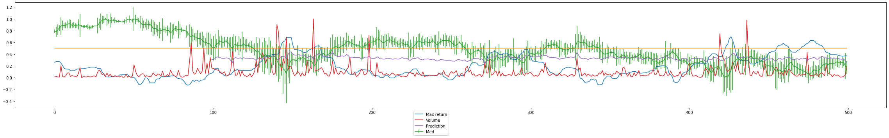

# Deep Trading

Some experiments playing with varius NNs to find/detect micro patterns and trends in financial assets prices.

The following notbooks show how good various model are at detecting trigger patterns conceiled in a noisy random walk:
- trigger_on_random_walk_cnn.ipynb
- trigger_on_random_walk_lstm.ipynb
- trigger_on_random_walk_mlp.ipynb

The experiment in cnn_cont.ipynb applies the same concept to historical prices of crypto assets.
